# <a name="Home"></a> Hibernate Basic

## Table of Content:
- [JPA](#JPA)
- [Java Application](#application)
- [Domain object](#domainobject)
- [Persistence Unit (persistence.xml)](#persistence)
- [Логирование](#logging)
- [Entity (сущности)](#entity)
- [ID Generation](#id)
- [Mapping](#mapping)
- [Lifecycle](#lifecycle)
- [Associations](#associations)
	- [One-to-One](#onetoone)
    - [One-to-Many & Many-to-One](#onetomany)
    - [Many-to-Many](#manytomany)


## [↑](#Home) <a name="java"></a> Java Persistence API (JPA)
Основная ценность в современном мире - это информация. И одна из самых главных задач программного обеспечения - обработка этой информации. Как и у всего вокруг, у информации (т.е. данных) есть свой жизненный цикл. И уже давно требуется, чтобы данные жили дольше чем процесс программы.
Такое сохранение данных называется **"Persistence"**.

Так как Java приложениям требуется сохранять данные, то решили придумать некоторые общие правила, по которым Java приложения смогут работать и сохранять (**persist**) данные.
И такими правилами является спецификаия JPA - **"Java Persistence API"**.
Спецификация есть на сайте Oracle: **"[JSR-000338 JavaTM Persistence 2.1 Final Release](https://download.oracle.com/otndocs/jcp/persistence-2_1-fr-eval-spec/index.html)"**.
Кроме этого, спецификация доступна на github странице **[Java Persistence API specification](https://github.com/javaee/jpa-spec)**.

Есть такое понятие, как **"Three-tier architecture"** (трёхуровневая архитектура). Данная архитектура разграничивает приложение на три слоя/уровня:

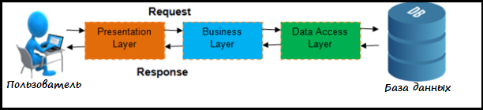

Уровень "Представление" (**Presentation**) отвечает за представление данных пользователю, а так же через это же представление позволяет пользователю взаимодействовать с приложением. Можно сказать, что это такой интерфейс взаимодействия приложения с пользователем.
Уровень "Бизнес логика" (**Business Layer**) занимается манипуляцией с данными. Именно этот слой знает, по каким правилам нужно создавать/удалять/изменять данные.
Уровень "Доступа к данным" (**Data Access Layer**) отвечает за непосредственно сохранение/удаление/изменение в источник данных.

**JPA** призван решить некоторые проблемы на последнем уровне доступа к данным:
- Удобно соотнести Java классы с данными в БД.
- Уменьшить связанность с конкретными технологиями хранения данных

Удобство работы с БД решается при помощи использования технологии ORM.
**ORM** - это Object-Relational Mapping. Благодаря этой технологии класс проецируется на таблицу в БД и наоборот:

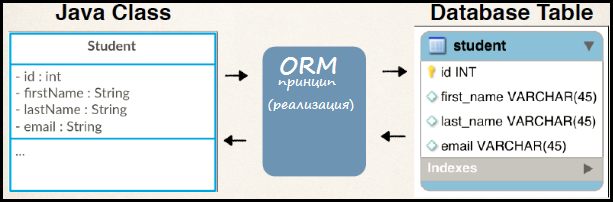

Проблема тесной связи с технологиями хранения данных решается при помощи введения более верхнеуровневого (более абстрактного) API. То есть вместо "Сохрани в базу данных" приложение теперь просто говорит "Сохрани данные".
Например, раньше для работы с базами данных java код приложения зависел напрямую от **JDBC**. Теперь же работа с JDBC скрыта за более высокоуровневым API.
Таким образом код программы теперь старается максимально мало знать о том, где и каким образом хранятся данные и сделать упор на том, как и когда нужно сохранять данные.

Чтобы у приложения появился доступ к JPA нужно добавить нужный **jar** архив.
В современном мире для таких целей служат глобальные репозитории, такие как [Maven Central](https://mvnrepository.com/repos/central) и [JCenter](https://bintray.com/bintray/jcenter).
Пакет, в котором лежат интерфейсы для работы с Persistence называется **javax.persistence**, а **jar** - "[javax.persistence-api](https://mvnrepository.com/artifact/javax.persistence/javax.persistence-api/2.2)".

Естественно, если есть API, то должен быть кто-то, кто будет реализовывать спецификацию, то есть выполнять все действия. Такой исполнитель называется **провайдером** (**jpa provider**).
Одним из самых популярных jpa провайдеров является [Hibernate](https://hibernate.org/orm/).
В документации Hibernate можно найти пункт "[1.1. The Hibernate Modules/Artifacts](https://docs.jboss.org/hibernate/orm/5.4/quickstart/html_single/#_the_hibernate_modules_artifacts)", который гласит, что самое его сердце называется **hibernate core**.
Именно так мы и сможем найти нужный **jar** на Maven central: "[hibernate-core](https://mvnrepository.com/artifact/org.hibernate/hibernate-core)".

Теперь, мы знаем, что есть JPA (Java persistence API) и его реализация.
Дело за малым - создать Java приложение, которое будет этим всем пользоваться.


## [↑](#Home) <a name="application"></a> Java Application
Наша цель - создать Java приложение, которое будет использовать нужные библиотеки. Собирать это всё вручную каждый раз неудобно и долго. Мир для этого давно используется автоматические системы сборки проектов.
Самые популярные из них: **"[Maven](https://maven.apache.org/)"** и **"[Gradle](https://gradle.org/)"**.
Установим себе одну из них, например **[установим Gradle](https://docs.gradle.org/current/userguide/installation.html)**.

**Gradle** позволяет выполнять различные действия над проектами благодаря своим плагинам. Часть из них устанавливается вместе с Gradle. Эта группа плагинов называется **"[Gradle core plugins](https://docs.gradle.org/current/userguide/plugin_reference.html)"**.
Именно в эту группу входит нужный нам плагин - **"[Gradle Build init plugin](https://docs.gradle.org/current/userguide/build_init_plugin.html)"**.

Плагин **"Build init"** добавляет gradle task, выполнив который мы инициализируем (**initialize**) проект. Название у него соответствующее: **init**.

**Создадим** [Java Application](https://docs.gradle.org/current/userguide/build_init_plugin.html#sec:java_application) из командной строки (Для ОС Windows: win + R, cmd):
```gradle init --type java-application```

На все вопросы отвечаем нажатием Enter, т.к. значения по умолчанию нас устроят.
После успешного выполнения импортируем проект в IDE, например в IntelliJ Idea.

**[Build Script](https://docs.gradle.org/current/userguide/tutorial_using_tasks.html)** - это то место, для используя систему сборки мы должны описывать все нюансы сборки проекта.
В данном файле описываются основные моменты: компиляций, подготовка артефактов, настройки. И самое главное - какие другие **jar** архивы с библиотеками/фрэймворками мы собираемся использовать. Т.к. наш проект начинает от них зависеть, то такие **jar** становятся зависимостями, т.е. **dependencies**:
```
dependencies {
    implementation 'javax.persistence:javax.persistence-api:2.2'
    implementation 'org.hibernate:hibernate-core:5.4.8.Final'
    testImplementation 'junit:junit:4.12'
}
```
Таким образом мы начинаем использовать JPA спецификацию версии 2.2 (зависимость от API, описанного спецификацией), а так же её реализацию - Hibernate.
Кроме этого, мы собираемся использовать JUnit - библиотеку для написания юнит тестов.

Современные IDE (например, IntelliJ Idea) могут показать, какие зависимости есть у нашего проекта:


Чтобы проверить, что на данном этапе всё сделано правильно (т.е. проект вообще собирается), выполним команду **"gradle run"**:

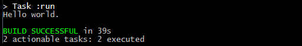

Если мы импортировали проект в JetBrains IDEA, то можно на вкладке Gradle выполнить задачу **"run"** (указана стрелкой на скриншоте). Тогда JetBrains IDEA за нас выполнит команду ``gradle run``. Таким образом мы можем проверить, что наше приложение работает и готово к свершениям.


## [↑](#Home) <a name="domainobject"></a> Domain object
Начнём с начала [JPA Specification](https://github.com/javaee/jpa-spec/blob/master/jsr338-MR/JavaPersistence.pdf), а именно с главы **"Chapter 1 Introduction"**. В ней сказано, что есть такое понятие, как **domain model** (доменная модель). Она в свою очередь состоит из **domain object**, т.е. доменных объектов или объектов доменной области. Доменную область ещё называют "предметной областью".

Каждая программа под собой имеет некоторую предметную область, проблемы которой она решает. Если это машины, то программа будет работать с такими понятиями предметной область, как "машина", "дорога", "светофор" и т.д. Если программа написана для организации учёта учеников, преподавателей и курсов, то понятиями предметной области будут "студент", "учитель" и т.д.

Приложение понятие предметной области представлят Java классом.
Например, в нашей системе каждый студент будет иметь учётую запись. Смоделируем её:
```java
package app.model;

public class Account {
    private String name;
}
```
Нам понадобятся геттеры и сеттеры для полей + конструкторы. Эти простые вещи вынуждают писать нас избаточный однотипный код, его называют **boilerplate code**.

От этого можно избавиться, подключив к проекту новую зависимость **[Lombok](https://projectlombok.org/setup/gradle)**:
```
compileOnly 'org.projectlombok:lombok:1.18.10'
annotationProcessor 'org.projectlombok:lombok:1.18.10'
```

Никакой магии нет. Данная библиотека позволяет аннотациями указать, что мы хотим добавить. А самим добавлением будет заниматься Lombok в момент компиляции кода.
Для этого используется так называемый **Annotation Processor**. То есть перед тем, как будет получен финальный **.class** файл с байт-кодом Java процессор аннотаций добавит нужные нам вещи (например, геттеры и сеттеры).
В отличии от Gradle, наша IDE не знает про то, что надо использовать процессоры аннотаций. Надо об этом явно сказать, иначе магия не сработает:


Теперь мы можем смело написать Java класс, который будет представлять профессора:
```java
package app.model;

import lombok.Data;

@Data // Добавит геттер + сеттер
public class Account {
    private String name;
}
```
Теперь, у нас есть **Java Domain Object**. Нужно его доставить в мир JPA.


## [↑](#Home) <a name="persistence"></a> Persistence Unit (persistence.xml)
Итак, у нас есть приложение и даже есть что сохранить (Account). Нужно подружить наше приложение с JPA провайдером, то есть с Hibernate.

Часто единицей чего либо называют юнитом (Unit). Например, в играх единица в армии - юнит. Или Юнит тест - тестирование какой-то одной функции. Или в учебниках есть юниты, т.е. некоторые самодостаточные единицы материала. Так и в JPA.
**Persistence Unit** - это та самая единица в терминах JPA, самодостаточная, с определёнными настройками, со знанием того как и что сохранять. Persistence Unit - это своего рода некая область, которая объединяет управляемые JPA провайдером классы и их настройки.
Иногда можно встретить такой перевод, как "Единицы постоянства" =)

**persistence.xml** - это файл, в котором описываются доступные Persistent Unit'ы.
Как сказано в главе **8.2.1 persistence.xml file** спецификации JPA:
> The persistence.xml file is located in the META-INF directory

То есть persistence.xml должен быть в подкаталоге **META-INF**, который должен быть на classpath нашего Java приложения. Так где должен тогда быть **META-INF**?

У каждой системы сборки есть свой **"project layout"**.
У Gradle благодаря плагину "java" есть свой [Java Project Layout](https://docs.gradle.org/current/userguide/java_plugin.html#sec:java_project_layout).
Т.к. каталог **src/main/resources**, согласно **project layout**, находится на **classpath**, то подкаталог **META-INF** следует создать там.
Работая в IntelliJ Idea можно выбрать Resources и нажать **Alt + Insert**:

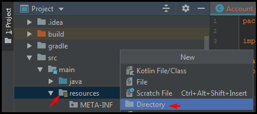

Создадим в данном подкаталоге файл **persistence.xml**.
Заполним его по образу того, как это указано в спецификации JPA в разделе **8.3 persistence.xml Schema**, а описание Persistence Unit можно взять из раздела **8.2.1 persistence.xml file**:
```xml
<persistence xmlns="http://xmlns.jcp.org/xml/ns/persistence"
             xmlns:xsi="http://www.w3.org/2001/XMLSchema-instance"
             xsi:schemaLocation="http://xmlns.jcp.org/xml/ns/persistence
 http://xmlns.jcp.org/xml/ns/persistence/persistence_2_2.xsd"
             version="2.2">
    <persistence-unit name="SimpleUnit">
        <description>Simple Persistence Unit</description>
        <provider>org.hibernate.jpa.HibernatePersistenceProvider</provider>

    </persistence-unit>
</persistence>
```

Теперь нужно подключить наш Persistence Unit к БД.
Для этого добавим в наш проект зависимость от базы данных **[H2 Database](http://www.h2database.com/html/cheatSheet.html)**:
```
implementation 'com.h2database:h2:1.4.200'
```

Осталось только описать подключение для Persistence Unit (после атрибута provider):
```
<properties>
	<property name="javax.persistence.jdbc.driver" value="org.h2.Driver"/>
	<property name="javax.persistence.jdbc.url" value="jdbc:h2:mem:test"/>
	<property name="javax.persistence.jdbc.user" value="sa"/>
	<property name="javax.persistence.jdbc.password" value="sa"/>
	<property name="hibernate.dialect" value="org.hibernate.dialect.H2Dialect"/>
    <property name="javax.persistence.schema-generation.database.action" value="create"/>
</properties>
```

Для тестирования мы указали **javax.persistence.schema-generation.database.action**, чтобы JPA Provider сам создавал базу данных по JPA аннотациям. В настоящих проектах это считается плохой практикой. Но для учебных проектов вроде нашего это допустимо и упрощает жизнь.

Чтобы проверить, что оно всё работает, напишем простой юнит тест.
Как мы видели ранее, у нас есть зависимость, которая появилась при генерации проекта - **junit**. Именно она позволяет нам создавать **J**ava **Unit**-тесты.
Создадим простой юнит тест для проверки, что наш Persistence Unit настроен верно:

В мире JPA доступ к Persistence Unit начинается с **EntityManagerFactory**.
Добавим тест инициализации **EntityManagerFactory** в класс **AppTest**:
```java
@Test
public void shouldCreatePersistenceUnit() {
	String unitName = "SimpleUnit";
	EntityManagerFactory emf;
	emf = Persistence.createEntityManagerFactory(unitName);
	assertTrue(emf.isOpen());
	emf.close();
}
```
Выполним тест **shouldOpenEmFactory()** чтобы проверить, что мы всё сделали верно.
При запуске теста будет инициализирован наш Persistence Unit.
Если мы что-то сделали не так, то всё упадёт с ошибкой. Этого для проверки хватит.

Более подробно про persistence.xml можно прочитать здесь:
"[THOUGHTS ON JAVA: A Beginner’s Guide to JPA’s persistence.xml](https://thoughts-on-java.org/jpa-persistence-xml)"

Далее, чтобы понимать, что же происходит нам необходимо настроить логирование.


## [↑](#Home) <a name="logging"></a> Логирование
Прежде чем мы начнём настроим логирование.
Для этого нам понадобится библиотека **[log4j](https://logging.apache.org/log4j/2.x/maven-artifacts.html)**.
Согласно документации log4j добавим две новые зависимости:
```
implementation 'org.apache.logging.log4j:log4j-api:2.12.1'
implementation 'org.apache.logging.log4j:log4j-core:2.12.1'
```

Далее остаётся настроить log4j, например при помощи [Configuration with XML](https://logging.apache.org/log4j/2.x/manual/configuration.html#XML).
Для этого создадим файл **log4j2.xml** в каталоге **src/main/resources**.

По примеру "[Hibernate 5 + Log4j 2 configuration example](https://www.boraji.com/hibernate-5-log4j-2-configuration-example)" напишем:
```xml
<?xml version="1.0" encoding="UTF-8"?>
<Configuration>
	<Appenders>
		<!-- Console Appender -->
        <Console name="Console" target="SYSTEM_OUT">
            <PatternLayout pattern="%d{yyyy-MMM-dd HH:mm:ss a} [%t] %-5level %logger{36} - %msg%n" />
        </Console>
    </Appenders>
    <Loggers>
        <!-- Log everything in hibernate -->
        <Logger name="org.hibernate" level="info" additivity="false">
            <AppenderRef ref="Console" />
        </Logger>
        <!-- Log SQL statements -->
        <Logger name="org.hibernate.SQL" level="debug" additivity="false">
            <AppenderRef ref="Console" />
        </Logger>
        <!-- Log JDBC bind parameters -->
        <Logger name="org.hibernate.type.descriptor.sql" level="trace" additivity="false">
            <AppenderRef ref="Console" />
        </Logger>
        <Root level="error">
            <AppenderRef ref="Console" />
        </Root>
    </Loggers>
</Configuration>
```
Теперь логирование будет идти через **log4j**.
Если мы снова выполним тест, то мы увидим, что всё логирование идёт на консоль в указанном нами формате.

Подробнее про логирование можно прочитать здесь:
"[Hibernate Logging Guide – Use the right config for development and production](https://thoughts-on-java.org/hibernate-logging-guide/)"


## [↑](#Home) <a name="entity"></a> Entity (сущности)
Итак, предварительные действия выполнены. Пора погрузиться в мир JPA.
**Entity** или сущности - основа мира JPA.
В спецификации JPA этой теме посвящён раздел **"Chapter 2 Entities"**.

Спецификация говорит, то **Entity** - это некий сохраняемый объект доменной области.
Например, у нас есть понятие доменной области - **Account**.

Чтобы сущность из мира Java стала сущностью в мире JPA нужна аннотация **@Entity**.
Также к сущностям предъявляются следующие требования:
- должен быть конструктор без аргументов (при этом можно иметь и другие конструкторы)
- сущность выражена верхнеуровневым классом (т.е. не вложенным)
- класс не должен быть final и не должны быть final переменные/методы

Ещё очень важно уметь однозначно идентифицировать запись. Например, в база данных для этого используется **"Первичный Ключ"**, он же **Primary Key** (**PK**).
Чтобы JPA Provider понимал, какое поле нужно соотнести с Primary Key нужно аннотировать такое поле при помощи аннотации **@Id**.

Адаптируем наш код для Account в соответствии с требованиями спецификации JPA:
```java
@Data // Добавит геттер + сеттер
@NoArgsConstructor // Для JPA
@Entity
public class Account {
    @Id
    private Long id;

    private String name;
}
```

Говоря про анотацию **@Id** стоит помнить про то, что по умолчанию именно она влияет на то, как JPA провайдер (в нашем случае Hibernate) работает с сущностями.
Существует два способа:
- **property access** (через геттер и сеттер)
- **field access** (напрямую через поля при помощи reflection)

Если аннотацию **@Id** поставить над геттером - будет property acсess, а если над полем - field access. Всё логично. Кроме того, на этот факт можно повлиять при помощи аннотации "[@Access](https://docs.jboss.org/hibernate/orm/5.4/userguide/html_single/Hibernate_User_Guide.html#access)".

Дополним наш тест в **AppTest** инициализации Persistence Unit сохранением сущности:
```java
@Test
public void shouldCreatePersistenceUnit() {
	String unitName = "SimpleUnit";
	EntityManagerFactory emf;
	emf = Persistence.createEntityManagerFactory(unitName);
	assertTrue(emf.isOpen());
	EntityManager em = emf.createEntityManager();
	Account acc = new Account();
	acc.setName("ADMIN");
	em.persist(acc);
	emf.close();
}
```

Но если мы сейчас выполним тест, то получим ошибку:
> Unknown entity: app.model.Account

Стоит обратить внимание на некоторый нюанс поиска сущностей JPA Provider'ом.
По умолчанию JPA провайдер ищет сущности в том месте, в котором найден persistence.xml (см. главу спецификации **8.2 Persistence Unit Packaging**).
И тут вступают в силу нюансы различных систем сборок и различных артефактов.
Например, случай запуска тестов через Gradle (при помощи gradle test) описан в обсуждении "[JPA entity classes are not discovered automatically with Gradle](https://discuss.gradle.org/t/jpa-entity-classes-are-not-discovered-automatically-with-gradle/11339/6)" и решается добавлением в конец gradle build script настройки:
> sourceSets.main.output.resourcesDir = sourceSets.main.output.classesDirs.getSingleFile()

Данное решение поможет выполнять тесты через gradle test. Но не поможет вызывать тесты в самой IntelliJ Idea через контекстное меню методов. Потому что IntelliJ Idea имеет свои правила запуска тестов. Придётся пойти другим путём.
Есть альтернативный способ, можно явно указать классы сущностей в persistence.xml:
```xml
<provider>org.hibernate.jpa.HibernatePersistenceProvider</provider>
<class>hibernatebasic.model.Professor</class>
```

Новый тест выполняет persist - то есть сохранение сущности в БД (об этом мы будем говорить далее). Но в логе мы не видим никаких SQL INSERT выражений. Почему?
Всё дело в том, что все изменения выполняются в Persistence Context и без транзакций (своего рода связи с БД) они никуда не сохраняются.
Перепишем наш тест по правильному.
Можем подглядеть немного к "классикам", например к Vlad Mihalcea в его статью "[JPA test case templates](https://in.relation.to/2016/01/14/hibernate-jpa-test-case-template/)". Добавим в тест два метода, один из которых выполняется ДО каждого теста, а другой ПОСЛЕ каждого теста:
```java
public class AppTest {
    private EntityManagerFactory entityManagerFactory;
    private EntityManager em;

    @Before
    public void init() {
        entityManagerFactory = Persistence.createEntityManagerFactory("SimpleUnit");
        em = entityManagerFactory.createEntityManager();
    }

    @After
    public void destroy() {
        em.close();
        entityManagerFactory.close();
    }
```

Теперь наш тест будет выглядеть гораздо лучше:
```java
@Test
public void shouldPersistEntity() {
	Account acc = new Account();
	acc.setId(1L);
	acc.setName("ADMIN");
	em.getTransaction().begin();
	em.persist(acc);
	em.getTransaction().commit();
}
```
Теперь, данные будут действительно отправлены в БД и мы в логе увидим SQL запросы:

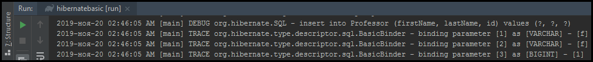

Всё хорошо, кроме того что мы явно указывали сами ID. Но JPA позволяет генерировать этот ID различными способами. В этом стоит разобраться.


## [↑](#Home) <a name="id"></a> ID Generation
Итак, у нас уже есть поле, помеченное как ID сущности. Именно по нему JPA Provider может отличить одну сущность от другой (что это два разных объекта):
```java
@Entity
public class Account {
    @Id
    private Long id;
```

Теперь необходимо разобраться, как для ID генерировать (**Generate**) значение (**Value**).
Сделать это просто. Нужно добавить аннотацию **@GeneratedValue**:
```java
@Id
@GeneratedValue
private Long id;
```

По умолчанию Hibernate автоматически выбирает принцип или стратегию, по которой будет получен ID.
Если мы хотим указать стратегию сами, нужно указать нужный **GenerationType**:
```java
@Id
@GeneratedValue(strategy = GenerationType.SEQUENCE, generator = "acc_gen")
private Long id;
```

Существуют следующие стратегии:
- GenerationType.AUTO - JPA Provider сам выберет стратегию (на основе БД)
- GenerationType.SEQUENCE - JPA Provider будет использовать Database Sequence
- GenerationType.IDENTITY - JPA Provider будет использовать отдельный столбец для ID
- GenerationType.TABLE - JPA Provider будет использовать отдельную таблицу

Они разные и у всех есть свои плюсы и минусы.

**GenerationType.TABLE** является устаревшим и самым не оптимальным выбором. Данная стратегия использует отдельную таблицу для хранения ID. Из-за необходимости поддерживать корректную работу нескольких потоков страдает производительность. Подробнее можно прочитать здесь:
**[Why you should never use the TABLE identifier generator with JPA and Hibernate](https://vladmihalcea.com/why-you-should-never-use-the-table-identifier-generator-with-jpa-and-hibernate/)**

**GenerationType.AUTO** является тоже не очень хорошим выбором. При этой стратегии JPA Provider сам выбирает стратегию на основе того, какая БД используется. И этот выбор не всегда является правильным. Например, Hibernate JPA Provider версии 5 на базах MySQL не имея возможности использовать SEQUENCE вместо IDENTITY выбирал TABLE, а это плохо, как мы видели ранее.
Подробнее можно прочитать здесь:
**[Why should not use the AUTO JPA GenerationType with MySQL and Hibernate](https://vladmihalcea.com/why-should-not-use-the-auto-jpa-generationtype-with-mysql-and-hibernate/)**

**GenerationType.IDENTITY** использует автоинкрементируемый столбец в таблице сущности. Особенность этого автоинкремента заключается в том, что инкрементация значения выполняется вне текущей транзакции, поэтому мы не можем узнать значения до выполнения INSERT выражения. Это приводит к тому, что Hibernate отключает пакетное выполнение SQL запросов (JDBC batch support).
Подробнее читать здесь:
**[Hibernate disabled insert batching when using an identity identifier generator](https://stackoverflow.com/questions/27697810/hibernate-disabled-insert-batching-when-using-an-identity-identifier-generator)**

**GenerationType.SEQUENCE** является самой оптимальной стратегией.
Она использует Database Sequence. Пример использоания:
```java
@Entity
public class Account {
    @Id
    @GeneratedValue(strategy = GenerationType.SEQUENCE, generator = "acc_gen")
    @SequenceGenerator(name = "acc_gen", sequenceName = "acc_seq")
    private Long id;
```

Теперь мы можем удалить из теста присваивание ID. Вернее будет сказать должны. Потому что теперь Hibernate будет считать, что если сущность имеет ID - то она уже есть в БД. А если она есть в БД, то получать такую сущность надо другим образом (это мы разберём чуть позже). В противном случае мы получим ошибку:
> PersistentObjectException: detached entity passed to persist

Теперь при выполнении теста мы увидим:

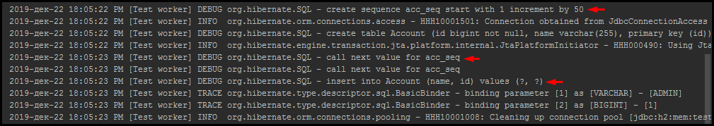

Интересной особенностью является то, что Hibernate чтобы постоянно не запрашивать следующий номер последовательности получается 2 следующих числа последовательности. Например, если шаг для sequence равен 50, то Hibernate получит значения 1 и 50. Таким образом на первые 50 новых значений будет сделано всего 2 запроса sequence.

Подробнее про маппинг и генерацию первичного ключа можно прочитать здесь:
- **[5 Primary Key Mappings for JPA and Hibernate Every Developer Should Know](https://thoughts-on-java.org/primary-key-mappings-jpa-hibernate/)**
- **[Hibernate Tip: How does Hibernate’s native ID generator work?](https://www.youtube.com/watch?v=QfuAMZLSvwo)**.


## [↑](#Home) <a name="mapping"></a> Mapping
Как мы уже ранее поняли, JPA - это про отображение Java объектов на базу данных и наоборот. Это называется **Object-Relational Mapping**.
Пора чуть подробнее разобраться с этим самым Mapping.

Во-первых, классы которые являются сущностями (т.е. аннотированы @Entity) отображаются на таблицы в БД. Без дополнительных указаний JPA Provider (например, Hibernate) отобразит сущность на таблицу с таким же названием. Но этим можно управлять, указав аннотацию **@Table**:
```java
@Entity
@Table(name = "ACCOUNT")
public class Account {
```

Говоря про маппинг таблиц стоит не забывать про то, что в Java у нас есть наследование. А следовательно, его надо как-то отображать на мир баз данных. Проблемы здесь добавляет то, что в мире реляционных баз данных нет понятия наследования. Поэтому, могут быть разные способы (стратегии), при помощи которых можно отобразить наследования. Для этого есть аннотация **@Inheritance**.

По умолчанию, если ничего не указано, то для Entity будет указана одноимённая таблица. Что будет совпадать со следующим:
```java
@Entity
@Table(name = "ACCOUNT")
@Inheritance(strategy = InheritanceType.SINGLE_TABLE)
public class Account {
```

Более подробно про стратегии наследования можно прочитать здесь:
- [Inheritance Strategies with JPA and Hibernate – The Complete Guide](https://thoughts-on-java.org/complete-guide-inheritance-strategies-jpa-hibernate/)
- [Mapping class inheritance in Hibernate 5](https://marcin-chwedczuk.github.io/mapping-inheritance-in-hibernate)

Если мы смогли соотнести таблицу с сущностью, то далее нужно соотнести поля сущности и столбцы, то есть колонки. По умолчанию JPA Provider будет соотносить поля с такими же по названию колонками, но на это можно повлиять аннотацией **@Column**:
```java
@Column(name = "ACC_NAME")
private String name;
```

Интересно, что аннотация @Column имеет возможность указать различные ограничения. Но стоит помнить, что эти ограчения будут работать только тогда, когда по аннотациям JPA Provider будет создавать структуру БД. Поэтому лучше воспользоваться реализацией **BeanValidation specification (JSR 303)**. Для этого можно воспользоваться реализацией этой спецификации. Например: **hibernate-validator**. Однако, аннотация @Column имеет полезные свойства, вроде insertable и updatable.

Подробнее можно прочитать здесь:
- [Hibernate Tips: What’s the difference between @Column(nullable = false) and @NotNull](https://thoughts-on-java.org/hibernate-tips-whats-the-difference-between-column-nullable-false-and-notnull/)
- [Difference Between @NotNull, @NotEmpty, and @NotBlank Constraints in Bean Validation](https://www.baeldung.com/java-bean-validation-not-null-empty-blank)

По умолчанию JPA Provider (например, Hibernate) умеет правильно выполнять "маппинг" различных Java типов на типы в БД. Но есть некоторые типы, которые не так очевидны.

Например, **Enum** в Java можно по-разному соотнести с колонками в БД. По умолчанию, Hibernate сохраняет Enum в БД как число, соответствующее **ordinal value**. На это можно повлиять при помощи аннотации **@Enumerated**.
Подробнее описано в материалах c **THOUGHTS ON JAVA**:
- [Hibernate Tips: How to map an Enum to a database column](https://thoughts-on-java.org/hibernate-tips-map-enum-database-column/)
- [Enum Mappings with Hibernate – The Complete Guide](https://thoughts-on-java.org/hibernate-enum-mappings/)
- [The best way to map an Enum Type with JPA and Hibernate](https://vladmihalcea.com/the-best-way-to-map-an-enum-type-with-jpa-and-hibernate/)

Другим специфическим типом данных являются даты. Связано это с тем, что дату можно представить как дату (DATE), время (TIME) или вместе (TIMESTAMP). В JPA для уточнения этой информации есть аннотацией **@Temporal**. Данная аннотация применима только к Java типам **java.util.Date** и **java.util.Calendar**.
Типы из **Date and Time API** "мапятся" без **@Temporal**.
Подробнее можно прочитать здесь:
- [Date and Time Mappings with Hibernate and JPA](https://thoughts-on-java.org/hibernate-jpa-date-and-time/)
- [How To Map The Date And Time API with JPA 2.2](https://thoughts-on-java.org/map-date-time-api-jpa-2-2/)
- [How to persist LocalDate and LocalDateTime with JPA 2.1](https://thoughts-on-java.org/persist-localdate-localdatetime-jpa/)


## [↑](#Home) <a name="lifecycle"></a> Lifecycle
Очень важным вопросом является жизненный цикл (lifecycle).
Жизненный цикл описан в спецификации в разделе **"3.2 Entity Instance’s Life Cycle"**.
Про lifecycle можно так же прочитать непосредственно у Hibernate: "[5. Persistence Context](https://docs.jboss.org/hibernate/orm/5.4/userguide/html_single/Hibernate_User_Guide.html#pc)".
Итак, путь любого instance сущности начинается с состояния **new** (Hibernate называет это состояние **transient**). На этот момент про instance никто не знает.
На примере предыдущего теста:
```java
@Test
public void shouldPersistEntity() {
	Account acc = new Account(); // 1. New (transient)
    acc.setName("ADMIN");
```

JPA Provider начинает отслеживать любые изменения в instance сущности только тогда, когда этот instance находится в некой зоне видимости или владении, которая называется Persistence Context. Это своего рода такая закрытая кухня, где происходит вся JPA магия. Для удобства работы с Persistence Context есть своего рода посредник, который и называется Entity Manager.

Благодаря EntityManager мы можем сохранить в Persistence Context экземпляр сущности. На этом этапе никакого сохранения никуда больше не происходит. Persistence Context называют ещё кэшем первого уровня, поэтому можно ещё воспринимать это как кэширование:
```java
@Test
public void shouldPersistEntity() {
	Account acc = new Account(); // 1. New (transient)
	acc.setName("ADMIN");
	em.persist(acc); // 2. Persisted
```
После этого instance сущности становится **persisted** и любые изменения, которые мы сделаем в данной сущности, будут сохранены при наступлении нужного момента.

Для наступления "нужного момента" нам осталось только создать транзакцию (своего рода сеанс общения с источником данных) и подтвердить её (сделать commit):
```java
// 4. Commit transaction
em.getTransaction().begin();
em.getTransaction().commit();
```
При завершении транзакции будет выполнен FLUSH всех изменений. При этом у JPA Provider'а будет запущен механизм проверки изменений, называемый **Dirty-check**.
Чтобы увидеть его в логе по умолчанию необходимо добавить новый логгер:
```xml
<!-- Dirty check -->
<Logger name="org.hibernate.event.internal.AbstractFlushingEventListener" level="trace" additivity="false">
	<AppenderRef ref="Console" />
</Logger>
```
Подробнее про данный механизм можно прочитать здесь:
- [The anatomy of Hibernate dirty checking mechanism](https://vladmihalcea.com/the-anatomy-of-hibernate-dirty-checking/)

После каждого теста мы закрываем Entity Manager, то есть завершаем сессию работы с Persistence Context. Это приводит к тому, что все сущности из Persistence Context переходят в статус Detached:
```java
@After
public void destroy() {
	em.close();
```

Кроме того, Entity Manager позволяет выполнять и другие действия.
Чтобы получить снова persisted инстанс мы можем сделать 2 вещи:
- Выполнить поиск сущности по ID:
```java
Professor entity2 = em.find(Professor.class, 1L);
```
- Выполнить мерж изменений:
```java
Professor entity2 = em.merge(entity);
```
Интересно, что в этом случае entity так и останется detached, а entity2 будет persisted.

Так же JPA позволяет удалить сущность при помощи метода **em.remove**.
Подробнее можно посмотреть в данном видео:
- [JPA vs Hibernate : The difference between save, persist, merge and update](https://www.youtube.com/watch?v=SH29O-bcQlc&t=453s)

По данной теме важно так же прочитать статью: [How do find and getReference EntityManager methods work when using JPA and Hibernate](https://vladmihalcea.com/entitymanager-find-getreference-jpa/)

Таким образом жизненный цикл можно отобразить следующим образом:

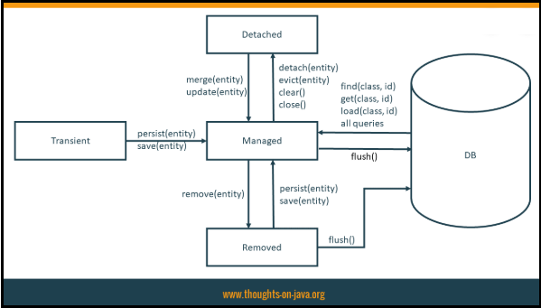


## [↑](#Home) <a name="associations"></a> Associations
ORM - это про связи одних сущностей с другими сущностями.
Таким образом, эти связи нужно как-то указывать. И в этом стоит разбираться.

Во-первых, у каждой связи есть "владелец" или **owner**.
**Owner** - это та сторона связи, на которой определён **Foreign Key**. То есть эта та сторона, которая "владеет" ссылкой на другую сторону ассоциации.

**Reference side** - это та сторона, на котору ссылаются. Она **НЕ** содержит FK на другую часть ассоциации.

Таблицы в БД имеют как столбцы с **Primary Key** (т.е. столбец по которому можно однозначно идентифицировать запись), например ID. И есть столбцы с **Foreign Key**, то есть столбцы, которые содержат идентификатор записи из другой таблицы, с которой связана та или иная запись данной таблицы. Например, в таблице Course столбцом с Foreign Key может служить столбец professor_id.


### [↑](#Home) <a name="onetoone"></a> **One-to-One**
Самая простая и мало используемая ассоциация - один к одному или **One-to-One**.
Однако на ней проще всего понять основную идею ассоциаций.

Во первых, если у нас есть аккаунт, то нужно создать для него связь. Например, со студентом. Добавим новую сущность студента:
```java
@Entity
public class Student {
    @Id
    @GeneratedValue(strategy = GenerationType.SEQUENCE,generator = "stud_gen")
    @SequenceGenerator(name = "stud_gen",sequenceName = "stud_seq")
    private Long id;

    private String name;

    private Account account;
}
```

**One-to-One** позволяет сказать, что One Student относится только к One Account:
```java
@OneToOne
private Account account;
```
Таким образом мы установили **One directional** связь (т.е. одностороннюю), при которой только Student знает про связанный с ним аккаунт. Кроме того, Student является Owner'ов, т.к. в таблице сущности Student содержится Foreign Key (FK), т.е. данные о том, какой ID аккаунта с каким студентом связан.

Аналогичную связь можно сделать и на другой стороне (т.е. на стороне Account):
```java
@OneToOne
private Student student;
```

Кроме того, такие вот атрибуты сущностей, которые участвуют в связях, если нужно изменить их имя, используют аннотации не **@Column**, а **@JoinColumn**.

Чтобы связь стала двунаправленной (т.е. **Bidirectional**) необходимо указать особый аттрибут - **mappedBy**. Как гласит JavaDoc метода:
```
The field that owns the relationship.
```
То есть данное поле указывает поле, которое "владеет" связью.
Например, таблица 1 (студенты) ссылается на таблицу 2 (аккаунты). Ссылка в таблице 1 хранится в столбце. А таблица 2 не содержит ссылку.
Таким образом, на стороне где **НЕТ ССЫЛОК** нужно сказать, как ссылку **ВЫЧИСЛИТЬ**:

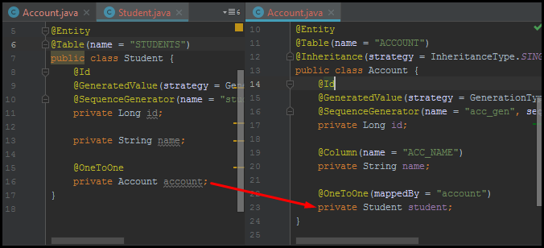

То есть таблица STUDENTS содержит столбец со ссылкой на ACCOUNT. А вот таблица ACCOUNT не имеет ссылок на STUDENTS. Поэтому, в сущности Students ничего дополнительно указывать не надо, там есть столбец. А вот в Account поле студента есть, но в реальности в БД такого поля нет. Поэтому мы и говорим Hibernate, что поле students надо определить по маппингу из Student по полю account, которое есть в каждом Student. Или проще говоря: Ищи по FK из поля account в сущности Student.

Поэтому, указываем ассоциацию:
```java
@OneToOne(mappedBy = "account")
private Student student;
```

Кроме этого, для любой Bidirectional (двусторонней) связи нужен метод, который будет эту ассоциацию указывать с двух сторон. Сам Hibernate это не делает.
Например, добавим метод в сущность Account:
```java
public void setAccount(Account acc) {
	this.account = acc;
	acc.setStudent(this);
}
```
Подробнее можно прочитать в статье от Vlad Mihalcea: "[How to synchronize bidirectional entity associations with JPA and Hibernate](https://vladmihalcea.com/jpa-hibernate-synchronize-bidirectional-entity-associations/)".
Так же отличный обзор на эту тему: "[Hibernate Tips: Easiest way to manage bi-directional associations](https://thoughts-on-java.org/hibernate-tips-easiest-way-to-manage-bi-directional-associations/)".

Кроме того, **One-To-One** обладает ещё одной удобной особенностью. Данная ассоциация предлагает возможно использовать один Id для нескольких сущностей. Так называемый **Shared Primary Key**. Для этого используется аннотация **@MapsId**.
Для примера, можно объяснить MapsId на этом примере:

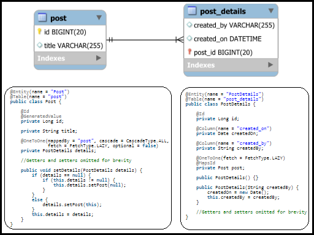

Вспоминая mappedBy, мы понимаем, что mappedBy находится на той стороне, где нет FK в базе данных, но поле в сущности есть. То есть в базе нет ссылки на post_id.
@MapsId работает в обратную сторону. Он ставится там, где есть FK. Он как бы говорит, что "используй FK чтобы получить PK". Таким образом, Post Details, по FK найдёт, post. Найдёт там ID и использует его как свой собственный ID.
Подробнее можно прочитать в статье "[The best way to map a @OneToOne relationship with JPA and Hibernate](https://vladmihalcea.com/the-best-way-to-map-a-onetoone-relationship-with-jpa-and-hibernate/)".

Кроме этого, в примере видна одна из общих для всех ассоциаций черт - **Fetch Type**.
**Fetch Type** - тип получения зависимых сущностей. Может быть два разных типа:
- FetchType.EAGER - принудительная загрузка всех зависимых сущностей
- FetchType.LAZY - загрузка только по требованию
Подробнее можно прочитать в материале: [Entity Mappings: Introduction to JPA FetchTypes](https://thoughts-on-java.org/entity-mappings-introduction-jpa-fetchtypes/)

И ещё одно интересное свойство - cascade. То есть как водопад идёт каскадами по нижестоящим ступенькам, так и операции каскадом в Hibernate спускаются от родительских сущностей к дочерним.
Например, мы можем сделать так, что если сохраняется Account, то сохраняется и зависимый студент:
```java
@OneToOne(mappedBy = "account", cascade = CascadeType.PERSIST)
private Student student;
```
Подробнее можно прочитать здесь:
- [Hibernate Tips: How to cascade a persist operation to child entities](https://thoughts-on-java.org/hibernate-tips-cascade-persist-operation-child-entities/)
- [A beginner’s guide to JPA and Hibernate Cascade Types](https://vladmihalcea.com/a-beginners-guide-to-jpa-and-hibernate-cascade-types/)

Наш тест тогда можно изменить и он станет выглядеть так:
```java
@Test
public void shouldPersistEntity() {
	Account acc = new Account(); // 1. New (transient)
	acc.setName("John89");
	Student student = new Student();
	student.setName("John");
	student.setAccount(acc);
	em.persist(acc); // 2. Persisted
	// 3. Commit Transaction
	em.getTransaction().begin();
	em.getTransaction().commit();
}
```

Кроме того, остаётся последний атрибут, который не менее интересен.
**Orphan** - это английское слово, которое переводится как "сирота". В Hibernate же есть параметр **orphanRemoval**.
Подробнее про него можно прочитать здесь: "[Hibernate Tips: How to delete child entities from a many-to-one association](https://thoughts-on-java.org/hibernate-tips-how-to-delete-child-entities/)". А так же можно прочитать обсуждение здесь: "[What is the difference between cascade and orphan removal from DB?](https://stackoverflow.com/questions/18813341/what-is-the-difference-between-cascade-and-orphan-removal-from-db/18813411)".


### [↑](#Home) <a name="onetomany"></a> **One-to-Many** & **Many-to-One**
Пожалуй, самые распространённые ассоциации - **One-to-Many** и **Many-to-One**.

Начнём с того, что добавим новую сущность - курс, который ведёт преподаватель:
```java
@Data // Геттер + Сеттер
@NoArgsConstructor // Для JPA
@AllArgsConstructor
@Entity
public class Course {
    @Id
    @GeneratedValue(strategy = GenerationType.SEQUENCE)
    private Long id;

    private String title;

    public Course(String title) {
        this.title = title;
    }
}
```

Как мы помним, указание ассоциации начинается с описания текущей сущности и заканчивается описанием сущности, на которую мы ссылаемся. Например:
```java
@OneToMany List< Student> students = new ArrayList<>();
```
То есть по сути это описание: Курс One, а студентов Many.

Если мы хотим иметь возможность получить не только всех студентов курса, но и курс, назначенный студенту, то следует добавить аналогичное и с другой стороны ассоциации, то есть на стороне сущности Student:
```java
@ManyToOne private Course course;
```
То есть описание вида: Many студентов на One курс.

Таким образом у нас появились однонаправленные (т.е. **Unidirectional**) связи на каждой стороне. Такие связи несут риск неэффективной работы Hibernate. Подробнее о причинах можно прочитать здесь: "[Hibernate Tips: Map an Unidirectional One-to-Many Association Without a Junction Table](https://thoughts-on-java.org/hibernate-tips-unidirectional-one-to-many-association-without-junction-table/)".

Чтобы связь стала двунаправленной (т.е. **Bidirectional**) необходимо указать особый аттрибут - **mappedBy**. Как гласит JavaDoc метода:
```
The field that owns the relationship.
```
То есть данное поле указывает поле, которое "владеет" связью. Как и в случае One-to-One указывается там, где нет FK, но связь нужно как-то описать. Логично, что в случае сущности Student данная сущность представляет таблицу STUDENT, в которой есть столбец COURSE, который содержит ссылку (то есть FK) на курс.
А вот 1 курс содержит коллекцию студентов. Соответственно, FK нет. Значит тут и указываем аттрибут mappedBy:
```java
@OneToMany(mappedBy = "course")
private List< Student> students = new ArrayList<>();
```

При Biderectional связях крайне важно указывать **mappedBy** чтобы недопускать лишних действий (т.е. лишних запросов в БД) со стороны Hibernate, т.к. это скорей всего негативно скажется на производительности приложения.

Кроме того, стоит помнить, что если мы курсу укажем профессора, то это автоматически не отобразит профессору в коллекции привязанный курс. Для этого необходимо описать метод, при помощи которого такая двусторонняя связь будет обслуживаться.

По теме Many-to-One и One-to-many есть отличные материалы:
- [Hibernate Tip: How to Map a Bidirectional Many-to-One Association](https://www.youtube.com/watch?v=cI4jYr_iv3Y)
- [Best Practices for Many-To-One and One-To-Many Association Mappings](https://www.youtube.com/watch?v=tciSOIQngig)
- [Ultimate Guide – Association Mappings with JPA and Hibernate](https://thoughts-on-java.org/ultimate-guide-association-mappings-jpa-hibernate/)
- [How to synchronize bidirectional entity associations with JPA and Hibernate](https://vladmihalcea.com/jpa-hibernate-synchronize-bidirectional-entity-associations/)
- [How do Set and List collections behave with JPA and Hibernate](https://vladmihalcea.com/hibernate-facts-favoring-sets-vs-bags/)

Стоит помнить, что сохраняя сущность с коллекцией других сущностей, по умолчанию мы не будем сохранять сущности из этой коллекции. По умолчанию, ни одно действие с сущностью не распространяется на его дочерние сущности. Но это можно организовать при помощи настройки **cascade**.
Подробнее про эту возможность можно прочитать здесь:
- [Hibernate Tips: How to cascade a persist operation to child entities](https://thoughts-on-java.org/hibernate-tips-cascade-persist-operation-child-entities/)
- [Why you should avoid CascadeType.REMOVE for to-many associations and what to do instead](https://thoughts-on-java.org/avoid-cascadetype-delete-many-assocations/)


### [↑](#Home) <a name="manytomany"></a> **Many-to-Many**
В базе данных Many to many может выглядеть следующим образом:

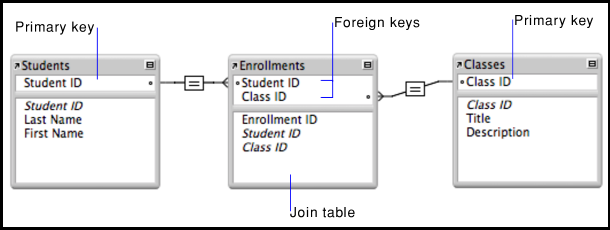

Данная связь похожа на расширенную версию **One-to-Many**. Каждая сторона имеет аннотацию не One-to-Many, а Many-to-Many.
Кроме того, рекомендуется хранить коллекцию типа Set. Аналогично One-To-Many нам так же понадобится вспомогательный метод обновления обеих сторон для добавления новой сущности в коллекцию.
Для Bidirectional связи аттрибут mappedBy можно выставить на любой стороне.

Кроме этого, мы можем указать дополнительные настройки:

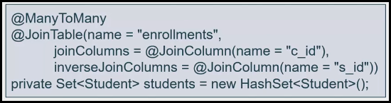

Подробнее можно прочитать в статье:
- [Best Practices for Many-to-Many Associations with Hibernate and JPA](https://thoughts-on-java.org/best-practices-for-many-to-many-associations-with-hibernate-and-jpa/)
- [Hibernate Tip: Many-to-Many Association with additional Attributes](https://thoughts-on-java.org/hibernate-tip-many-to-many-association-with-additional-attributes/)
- [The best way to use the @ManyToMany annotation with JPA and Hibernate](https://vladmihalcea.com/the-best-way-to-use-the-manytomany-annotation-with-jpa-and-hibernate/)


### [↑](#Home) <a name="jpql"></a> **JPQL**
**JPA** - это не только про автоматический маппинг. Но это ещё и про запросы.
Во-первых, JPA позволяет SQL Query, они же Native Query. Подробнее про это можно прочитать в материале: [Native Queries – How to call native SQL queries with JPA & Hibernate](https://thoughts-on-java.org/jpa-native-queries/). Кроме того будет полезно прочитать про механизм AUTOFLUSH: [How does AUTO flush strategy work in JPA and Hibernate](https://vladmihalcea.com/how-does-the-auto-flush-work-in-jpa-and-hibernate/).

JPA предоставляет свой язык запросов - Java Persistence Query Language, JPQL.
Это своего рода симбиоз JPA и SQL.

Например, в тест сохранения сущности можем добавить проверку существования сущности через JPQL:
```java
// 4. JPQL
TypedQuery<Student> studentQuery;
studentQuery = em.createQuery("SELECT s FROM Student s", Student.class);
List<Student> resultList = studentQuery.getResultList();
Assert.assertEquals(1, resultList.size());
```

Кроме того, JPQL позволяет использовать различные JOIN'ы, о чём подробнее можно прочитать в обзоре: [Hibernate Tips: What’s the Difference between JOIN, LEFT JOIN and JOIN FETCH](https://thoughts-on-java.org/hibernate-tips-difference-join-left-join-fetch-join/).

Есть отличный материал на тему JPQL:
- [Ultimate Guide to JPQL Queries with JPA and Hibernate](https://thoughts-on-java.org/jpql/)
- [Using the Optimal Query Approach and Projection for JPA and Hibernate](https://thoughts-on-java.org/optimal-query-and-projection-jpa-hibernate/)
- [Hibernate Tips: How to downcast entities in JPQL queries](https://thoughts-on-java.org/hibernate-tips-downcast-entities-jpql-queries/)
- [Hibernate Tips: How to use pagination with JPQL](https://thoughts-on-java.org/hibernate-tips-use-pagination-jpql/)