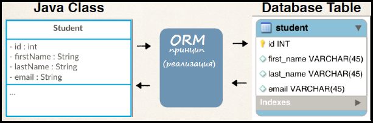
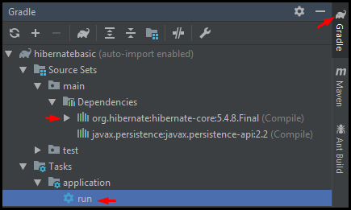
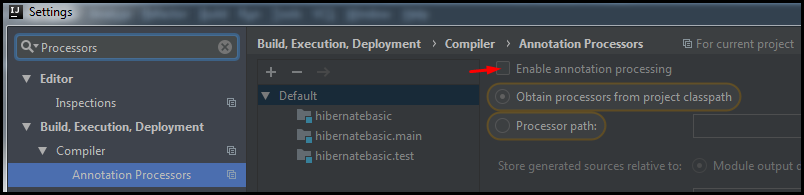
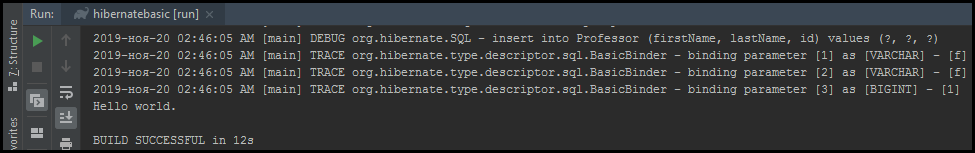
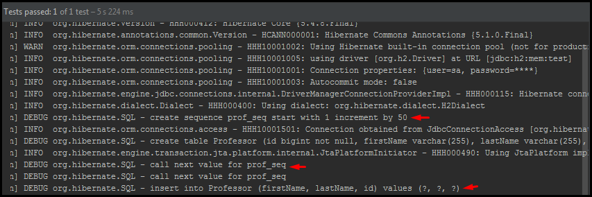

# <a name="Home"></a> Hibernate Basic

## Table of Content:
- [JPA](#JPA)
- [Java Application](#application)
- [Persistence Unit (persistence.xml)](#persistence)
- [Логирование](#logging)
- [Domain object](#domainobject)
- [Entity (сущности)](#entity)
- [ID Generation](#id)
- [Mapping](#mapping)


## [↑](#Home) <a name="java"></a> Java Persistence API (JPA)
Основная потребность современных программ - обработка данных. Как и у всего, у данных есть свой жизненный цикл. И уже давно требуется, чтобы данные жили дольше чем процесс программы. Такое сохранение данных называется **"Persistence"**.
Так как Java программам требуется сохранять данные, то решили придумать некоторые общие правила, по которым Java приложения смогут работать и сохранять (**persist**) данные. И такими правилами является спецификаия JPA - **"Java Persistence API"**.
Спецификация есть на сайте Oracle: **"[JSR-000338 JavaTM Persistence 2.1 Final Release](https://download.oracle.com/otndocs/jcp/persistence-2_1-fr-eval-spec/index.html)"**.
Кроме этого, спецификация доступна на github странице **[Java Persistence API specification](https://github.com/javaee/jpa-spec)**.

Есть такое понятие, как "Three-tier architecture" (трёхуровневая архитектура). Данная архитектура разграничивает приложение на три слоя/уровня:


Уровень "Представление" (**Presentation**) отвечает за представление данных пользователю, а так же через это же представление позволяет пользователю взаимодействовать с приложением. Можно сказать, что это такой интерфейс взаимодействия приложения с пользователем.
Уровень "Бизнес логика" (**Business Layer**) занимается манипуляцией с данными. Именно этот слой знает, по каким правилам нужно создавать/удалять/изменять данные.
Уровень "Доступа к данным" (**Data Access Layer**) отвечает за непосредственно сохранение/удаление/изменение в источник данных.
JPA призван решить некоторые проблемы на последнем уровне доступа к данным:
- Удобно соотнести Java классы с данными в БД.
- Уменьшить связанность с конкретными технологиями хранения данных

Удобство работы с БД решается при помощи использования технологии ORM - Object-Relational Mapping. Благодаря этой технологии класс проецируется на таблицу в БД и наоборот:



Проблема тесной связи с технологиями хранения данных решается при помощи введения более верхнеуровневого (более абстрактного) API. То есть вместо "Сохрани в базу данных" приложение теперь просто говорит "Сохрани данные".
Например, раньше для работы с базами данных код приложения зависел от JDBC напрямую.
Теперь же решили скрыть от приложения и программистов то, где и каким образом хранятся данные и сделать упор на том, как и когда нужно сохранять данные.

Чтобы у приложения появился доступ к JPA нужно добавить нужный **jar**. В современном мире для таких целей служат глобальные репозитории, такие как [Maven Central](https://mvnrepository.com/repos/central) и [JCenter](https://bintray.com/bintray/jcenter).
Пакет, в котором лежат интерфейсы для работы с Persistence называется **javax.persistence**, а **jar** - "[javax.persistence-api](https://mvnrepository.com/artifact/javax.persistence/javax.persistence-api/2.2)".

Естественно, если есть API, то должен быть кто-то, кто будет реализовывать спецификацию, то есть выполнять все действия. Такой исполнитель называется провайдером. И одним из самых популярных провайдеров является [Hibernate](https://hibernate.org/orm/).
В документации Hibernate можно найти пункт "[1.1. The Hibernate Modules/Artifacts](https://docs.jboss.org/hibernate/orm/5.4/quickstart/html_single/#_the_hibernate_modules_artifacts)", из которого следуется, что самое сердце называется hibernate core. Именно так мы и сможем найти нужный **jar** на Maven central: "[hibernate-core](https://mvnrepository.com/artifact/org.hibernate/hibernate-core)".

Теперь, мы знаем, что есть JPA (Java persistence API) и его реализация.
Дело за малым - создать Java приложение, которое будет этим всем пользоваться.


## [↑](#Home) <a name="application"></a> Java Application
Наша цель - создать Java приложение, которое будет использовать нужные библиотеки. Собирать это всё вручную каждый раз неудобно и долго. Мир для этого давно используется автоматические системы сборки проектов.
Самые популярные из них: **"[Maven](https://maven.apache.org/)"** и **"[Gradle](https://gradle.org/)"**.
Установим себе одну из них, например [установим Gradle](https://docs.gradle.org/current/userguide/installation.html).

Gradle позволяет выполнять различные действия над проектами благодаря своим плагинам. Часть из них встроенная и эта группа плагинов называется **"[Gradle core plugins](https://docs.gradle.org/current/userguide/plugin_reference.html)"**. Именно в эту группу входит нужный нам плагин - **"[Gradle Build init plugin](https://docs.gradle.org/current/userguide/build_init_plugin.html)"**.

Плагин **"Build init"** добавляет gradle task, выполнив который мы инициализируем (**initialize**) проект. Название у него соответствующее: **init**.
Выполним создание [Java Application](https://docs.gradle.org/current/userguide/build_init_plugin.html#sec:java_application) из командной строки (win + R, cmd):
```gradle init --type java-application```
На все вопросы отвечаем нажатием Enter, т.к. значения по умолчанию нас устроят.
После успешного выполнения импортируем проект в IDE, например в IntelliJ Idea.

Теперь перейдём в так называемый [Build Script](https://docs.gradle.org/current/userguide/tutorial_using_tasks.html) файл build.gradle, где описывается наш проект: из чего состоит, как его запускать и т.д.
Наш проект будет зависеть от JPA и его реализации Hibernate. Это зависимости нашего проекта, которые мы должны описать в блоке **dependencies**:
```
dependencies {
    implementation 'javax.persistence:javax.persistence-api:2.2'
    implementation 'org.hibernate:hibernate-core:5.4.8.Final'
    testImplementation 'junit:junit:4.12'
}
```

Современные IDE (например, IntelliJ Idea) могут показать, какие зависимости есть у нашего проекта:



Выполним задачу **"run"** (указана стрелкой на скриншоте).
JetBrains IDEA за нас тогда выполнит команду ``gradle run``. Таким образом мы можем проверить, что наше приложение работает и готово к свершениям.


## [↑](#Home) <a name="persistence"></a> Persistence Unit (persistence.xml)
Итак, у нас есть приложение. Теперь нужно научить его работать с JPA.
Для этого нужно описать так называемый **Persistence Unit**. Иногда можно встретить такой перевод, как "Единицы постоянства" =)
Persistence Unit своего рода некая область, которая объединяет управляемые JPA провайдером классы и их настройки.

Persistent Unit'ы описываются в файле **persistence.xml**. Как сказано в спецификации, "The persistence.xml file is located in the META-INF directory", т.е. данный файл должен быть в подкаталоге **META-INF**, который должен быть на classpath.

Где должен быть **META-INF**?
У каждой системы сборки есть свой **"project layout"**.
У Gradle благодаря плагину "java" есть свой [Java Project Layout](https://docs.gradle.org/current/userguide/java_plugin.html#sec:java_project_layout).
Т.к. каталог **src/main/resources**, согласно **project layout**, находится на **classpath**, то подкаталог **META-INF** следует создать там.

Создадим в данном подкаталоге **persistence.xml** по образу того, как это указано в спецификации JPA в разделе **8.3 persistence.xml Schema**, а описание Persistence Unit можно взять из раздела **8.2.1 persistence.xml file**:
```
<persistence xmlns="http://xmlns.jcp.org/xml/ns/persistence"
             xmlns:xsi="http://www.w3.org/2001/XMLSchema-instance"
             xsi:schemaLocation="http://xmlns.jcp.org/xml/ns/persistence
 http://xmlns.jcp.org/xml/ns/persistence/persistence_2_2.xsd"
             version="2.2">
    <persistence-unit name="SimpleUnit">
        <description>Simple Persistence Unit</description>
        <provider>org.hibernate.jpa.HibernatePersistenceProvider</provider>

    </persistence-unit>
</persistence>
```

Теперь нужно подключить наш Persistence Unit к БД.
Для этого добавим в наш проект зависимость от базы данных **[H2 Database](http://www.h2database.com/html/cheatSheet.html)**:
```
implementation 'com.h2database:h2:1.4.200'
```
Осталось только описать подключение в нашем Persistence Unit:
```
<properties>
	<property name="javax.persistence.jdbc.driver" value="org.h2.Driver"/>
	<property name="javax.persistence.jdbc.url" value="jdbc:h2:mem:test"/>
	<property name="javax.persistence.jdbc.user" value="sa"/>
	<property name="javax.persistence.jdbc.password" value="sa"/>
	<property name="hibernate.dialect" value="org.hibernate.dialect.H2Dialect"/>
    <property name="javax.persistence.schema-generation.database.action" value="create"/>
</properties>
```
Для тестирования мы указали **javax.persistence.schema-generation.database.action**, чтобы JPA Provider сам создавал базу данных по JPA аннотациям. В настоящих проектах это считается плохой практикой. Но для учебных проектов это допустимо и упрощает жизнь.

Чтобы проверить, что оно всё работает, напишем простой тест. Мы могли заметить зависимость, которая появилась при генерации проекта - **junit**. Именно она позволяет нам создавать **J**ava **Unit**-тесты. Создадим один.

В мире JPA доступ к Persistence Unit начинается с **EntityManagerFactory**.
Добавим тест инициализации **EntityManagerFactory**:
```java
public class AppTest {
    private final static String UNIT_NAME = "SimpleUnit";
    private static EntityManagerFactory EM_FACTORY;

    @Before
    public void init() {
        EM_FACTORY = Persistence.createEntityManagerFactory(UNIT_NAME);
    }

    @Test
    public void shouldOpenEmFactory() {
        assertTrue(EM_FACTORY.isOpen());
    }
}
```
Выполним тест **shouldOpenEmFactory()** чтобы проверить, что мы всё сделали верно.
При запуске теста будет инициализирован наш Persistence Unit.
Если мы что-то сделали не так, то всё упадёт с ошибкой. Этого для проверки хватит.

Более подробно про persistence.xml можно прочитать здесь:
"[THOUGHTS ON JAVA: A Beginner’s Guide to JPA’s persistence.xml](https://thoughts-on-java.org/jpa-persistence-xml)"

Далее, чтобы понимать, что же происходит нам необходимо настроить логирование.


## [↑](#Home) <a name="logging"></a> Логирование
Прежде чем мы начнём настроим логирование.
Для этого нам понадобится библиотека **[log4j](https://logging.apache.org/log4j/2.x/maven-artifacts.html)**.
Согласно документации log4j добавим две новые зависимости:
```
implementation 'org.apache.logging.log4j:log4j-api:2.12.1'
implementation 'org.apache.logging.log4j:log4j-core:2.12.1'
```
Далее остаётся настроить log4j, например при помощи [Configuration with XML](https://logging.apache.org/log4j/2.x/manual/configuration.html#XML).
Для этого создадим файл **log4j2.xml** в каталоге **src/main/resources**.

По примеру "[Hibernate 5 + Log4j 2 configuration example](https://www.boraji.com/hibernate-5-log4j-2-configuration-example)" напишем:
```xml
<?xml version="1.0" encoding="UTF-8"?>
<Configuration>
	<Appenders>
		<!-- Console Appender -->
        <Console name="Console" target="SYSTEM_OUT">
            <PatternLayout pattern="%d{yyyy-MMM-dd HH:mm:ss a} [%t] %-5level %logger{36} - %msg%n" />
        </Console>
    </Appenders>
    <Loggers>
        <!-- Log everything in hibernate -->
        <Logger name="org.hibernate" level="info" additivity="false">
            <AppenderRef ref="Console" />
        </Logger>
        <!-- Log SQL statements -->
        <Logger name="org.hibernate.SQL" level="debug" additivity="false">
            <AppenderRef ref="Console" />
        </Logger>
        <!-- Log JDBC bind parameters -->
        <Logger name="org.hibernate.type.descriptor.sql" level="trace" additivity="false">
            <AppenderRef ref="Console" />
        </Logger>
        <Root level="error">
            <AppenderRef ref="Console" />
        </Root>
    </Loggers>
</Configuration>
```
Теперь логирование будет идти через **log4j**.
Если мы снова выполним тест, то мы увидим, что всё логирование идёт на консоль в указанном нами формате.

Подробнее про логирование можно прочитать здесь:
"[Hibernate Logging Guide – Use the right config for development and production](https://thoughts-on-java.org/hibernate-logging-guide/)"


## [↑](#Home) <a name="domainobject"></a> Domain object
Итак, если мы откроём главу **"Chapter 1 Introduction"** из [JPA Specification](https://github.com/javaee/jpa-spec/blob/master/jsr338-MR/JavaPersistence.pdf), то увидим, что есть такое понятие, как **domain model** (доменная модель). Она в свою очередь состоит из **domain object**, т.е. доменных объектов или объектов доменной области. Доменную область ещё называют "предметной областью". И тут всё просто.

Например, программа написана для организации учёта учеников, преподавателей и курсов. Это и есть предметная область, для которой написана программа. Космос, автомобили, медицина - это всё тоже предметные области, которые состоят из разных понятий (т.е. из разных сущностей).
Таким образ, в качестве примера **domain object** можно привести сущность "Профессор". Эта сущность в мире Java будет выражена обычным Java классом.

И прежде чем начать, хочется немного упростить себе жизнь.
Java иногда имеет так называемый **boilerplate code** - это однотипный код, который приходится писать ради какой-нибудь простой цели. Например, яркий пример - геттеры и сеттеры.
От этого можно избавиться, подключив к проекту библиотеку **[Lombok](https://projectlombok.org/setup/gradle)**:
```
compileOnly 'org.projectlombok:lombok:1.18.10'
annotationProcessor 'org.projectlombok:lombok:1.18.10'
```
Никакой магии. Данная библиотека позволяет аннотациями указать, что мы хотим добавить. А добавлением будет заниматься Lombok. Для этого используется так называемый **Annotation Processor**. То есть перед тем, как будет получен финальный class файл с байт-кодом Java процессов аннотацией добавит нужные нам вещи (например, геттеры и сеттеры).
В отличии от Gradle, наша IDE не знает про то, что надо использовать процессоры аннотаций. Надо об этом явно сказать, иначе магия не сработает:



Теперь мы можем смело написать Java класс, который будет представлять профессора:
```java
@Data // Геттер + Сеттер
@NoArgsConstructor  // Для JPA спецификации (подробности далее)
@AllArgsConstructor // Для удобства создания
public class Professor {
    private String firstName;
    private String lastName;
}
```
Теперь, у нас есть **Java Domain Object**. Нужно его доставить в мир JPA.


## [↑](#Home) <a name="entity"></a> Entity (сущности)
Итак, предварительные действия выполнены. Пора погрузиться в мир JPA.
**Entity** или сущности - основа мира JPA.
В спецификации JPA этой теме посвящён раздел **"Chapter 2 Entities"**.

Спецификация говорит, то **Entity** - это некий сохраняемый объект доменной области.
Например, как мы ранее поняли, доменной областью может являться сфера обучения. Её сущности в мире Java будут выражены Java классами. Например, классом **Professor**.

Чтобы сущность из мира Java стала сущностью в мире JPA нужна аннотация **@Entity**.
Также к сущностям предъявляются следующие требования:
- должен быть конструктор без аргументов (при этом можно иметь и другие конструкторы)
- сущность выражена верхнеуровневым классом (т.е. не вложенным)
- класс не должен быть final и не должны быть final переменные/методы

И ещё одно важное требование - должен быть указан идентификатор сущности.
Данный идентификатор - это **primary key** (первичный ключ) в мире баз данных.
Такой идентификатор выражается анотацией **@Id**.

Говоря про анотацию **@Id** стоит помнить про то, что по умолчанию именно она влияет на то, как JPA провайдер (в нашем случае Hibernate) работает с сущностями.
Существует два способа:
- **property access** (через геттер и сеттер)
- **field access** (напрямую через поля при помощи reflection)

Если аннотацию **@Id** поставить над геттером - будет property acсess, а если над полем - field access. Всё логично. Кроме того, на этот факт можно повлиять при помощи аннотации "[@Access](https://docs.jboss.org/hibernate/orm/5.4/userguide/html_single/Hibernate_User_Guide.html#access)".

Изменим Java сущность **Professor** так, чтобы она стала **JPA Entity**:
```java
@Entity
@Data // Геттер + Сеттер
@NoArgsConstructor	// Для JPA конструктор без параметров
@AllArgsConstructor	// Для удобства конструктор со всеми параметрами
public class Professor {
    @Id
    private Long id;

    private String firstName;
    private String lastName;
}
```

Далее небольшой нюанс связанный с тем, как работает поиск сущностей.
По умолчанию JPA провайдер ищет сущности в jar архиве, в котором найден persistence.xml (см. главу спецификации **8.2 Persistence Unit Packaging**).
Но запуск тестов не собирают jar архив, поэтому этот подход не отработает для нас.

Поэтому, нам придётся явно указать классы сущностей в persistence.xml:
```xml
<provider>org.hibernate.jpa.HibernatePersistenceProvider</provider>
<class>hibernatebasic.model.Professor</class>
```

Напишем теперь простой тест на сохранение сущности:
```java
@Test
public void shouldPersistEntity() {
	Professor entity = new Professor(1L,"John","Doe");
	EntityManager em = EM_FACTORY.createEntityManager();
	em.persist(entity);
}
```
Во-первых, как мы видим, действия с Entity выполняются при помощи **EntityManager**. Во-вторых, мы не видим в логе никаких SQL запросов, хотя мы только что выполнили сохранение. А дело в том, что для этого EntityManager'у нужна транзакция.
Чуть изменим код:
```java
@Test
public void shouldPersistEntity() {
	Professor entity = new Professor(1L,"John","Doe");
	EntityManager em = EM_FACTORY.createEntityManager();
	em.getTransaction().begin();
	em.persist(entity);
	em.getTransaction().commit();
}
```
Теперь, данные будут действительно отправлены в БД и мы в логе увидим SQL запросы:



Всё хорошо, кроме того что мы явно указывали сами ID. Но JPA позволяет генерировать этот ID различными способами. В этом стоит разобраться.


## [↑](#Home) <a name="id"></a> ID Generation
Итак, у нас уже есть поле, помеченное как ID сущности. Именно по нему JPA Provider может отличить одну сущность от другой (что это два разных объекта):
```java
public class Professor {
    @Id
    private Long id;
```
Теперь необходимо разобраться, как этот ID генерировать автоматически.
Для того, чтобы ID генерировался автоматически достаточно к нему добавить аннотацию.
Аннотация **@GeneratedValue** указывает, что Value будет сгенерировано:
```java
@Id
@GeneratedValue
private Long id;
```
По умолчанию Hibernate автоматически выбирает принцип или стратегию, по которой будет получен ID.
Если мы хотим указать стратегию сами, нужно указать нужный **GenerationType**.
Существуют следующий стратегии:
- GenerationType.AUTO - JPA Provider сам выберет подходящую стратегию (на основе БД)
- GenerationType.SEQUENCE - JPA Provider будет использовать Database Sequence
- GenerationType.IDENTITY - JPA Provider будет использовать отдельный столбец для ID
- GenerationType.TABLE - JPA Provider будет использовать отдельную таблицу

Они разные и у всех есть свои плюсы и минусы.

Например, **GenerationType.TABLE** является устаревшим и самым не оптимальным выбором. Данная стратегия использует отдельную таблицу для хранения ID. Из-за необходимости поддерживать корректную работу нескольких потоков страдает производительность. Подробнее можно прочитать здесь:
**[Why you should never use the TABLE identifier generator with JPA and Hibernate](https://vladmihalcea.com/why-you-should-never-use-the-table-identifier-generator-with-jpa-and-hibernate/)**

Стратегия **GenerationType.AUTO** тоже не очень хорошим выбором. При этой стратегии JPA Provider сам выбирает стратегию на основе того, какая БД используется. И этот выбор не всегда является правильным. Например, Hibernate JPA Provider версии 5 на базах MySQL не имея возможности использовать SEQUENCE вместо IDENTITY выбирал TABLE, а это плохо, как мы видели ранее.
Подробнее можно прочитать здесь:
**[Why should not use the AUTO JPA GenerationType with MySQL and Hibernate](https://vladmihalcea.com/why-should-not-use-the-auto-jpa-generationtype-with-mysql-and-hibernate/)**

Стратегия **GenerationType.IDENTITY** использует автоинкрементируемый столбец в таблице сущности. Особенность этого автоинкремента заключается в том, что инкрементация значения выполняется вне текущей транзакции, поэтому мы не можем узнать значения до выполнения INSERT выражения. Это приводит к тому, что Hibernate отключает пакетное выполнение SQL запросов (JDBC batch support).
Подробнее читать здесь:
**[Hibernate disabled insert batching when using an identity identifier generator](https://stackoverflow.com/questions/27697810/hibernate-disabled-insert-batching-when-using-an-identity-identifier-generator)**

Стратегия **GenerationType.SEQUENCE** является самой оптимальной. Она использует Database Sequence. Пример использоания:
```java
public class Professor {
    @Id
    @GeneratedValue(strategy = GenerationType.SEQUENCE, generator = "prof_gen")
    @SequenceGenerator(name = "prof_gen", sequenceName = "prof_seq")
    private Long id;
```
Теперь при persist нельзя передавать ID, иначе получим ошибку:
```PersistentObjectException: detached entity passed to persist```

Теперь, добавим в класс Professor ещё один конструктор:
```java
public Professor(String firstName, String lastName) {
	this.firstName = firstName;
	this.lastName = lastName;
}
```
И в нашем тесте **shouldPersistEntity** сделаем вызов другого конструктора:
```java
Professor entity = new Professor("John", "Doe");
em.persist(entity);
```
Теперь при выполнении теста мы увидим:



Интересной особенностью является то, что Hibernate чтобы постоянно не запрашивать следующий номер последовательности получается 2 следующих числа последовательности. Например, если шаг для sequence равен 50, то Hibernate получит значения 1 и 50. Таким образом на первые 50 новых значений будет сделано всего 2 запроса sequence.

Подробнее про маппинг первичного ключа можно прочитать так же и здесь:
**[5 Primary Key Mappings for JPA and Hibernate Every Developer Should Know](https://thoughts-on-java.org/primary-key-mappings-jpa-hibernate/)**

Кроме этого, полезное видео: **[Hibernate Tip: How does Hibernate’s native ID generator work?](https://www.youtube.com/watch?v=QfuAMZLSvwo)**.


## [↑](#Home) <a name="mapping"></a> Mapping
Как мы уже ранее поняли, JPA - это про отображение Java объектов на базу данных и наоборот. Это называется **Object-Relational Mapping**.
Пора чуть подробнее разобраться с этим самым Mapping.

Во-первых, классы которые являются сущностями (т.е. аннотированы @Entity) отображаются на таблицы в БД. Без дополнительных указаний JPA Provider (например, Hibernate) отобразит сущность на таблицу с таким же названием. Но этим можно управлять, указав аннотацию **@Table**:
```java
@Data // Геттер + Сеттер
@NoArgsConstructor // Для JPA
@AllArgsConstructor
@Entity
@Table(name = "PROFESSOR", schema = "UNIVERSITY")
public class Professor {
```

Говоря про маппинг таблиц стоит не забывать про то, что в Java у нас есть наследование. А следовательно, его надо как-то отображать на мир баз данных. Проблемы здесь добавляет то, что в мире реляционных баз данных нет понятия наследования. Поэтому, могут быть разные способы (стратегии), при помощи которых можно отобразить наследования. Для этого есть аннотация **@Inheritance**.
По умолчанию, если ничего не указано, то для Entity будет указана одноимённая таблица. Что будет совпадать со следующим:
```java
@Entity
@Table(name = "PROFESSOR", schema = "UNIVERSITY")
@Inheritance(strategy = InheritanceType.SINGLE_TABLE)
public class Professor {
```
Более подробно про стратегии наследования можно прочитать здесь:
- [Inheritance Strategies with JPA and Hibernate – The Complete Guide](https://thoughts-on-java.org/complete-guide-inheritance-strategies-jpa-hibernate/)
- [Mapping class inheritance in Hibernate 5](https://marcin-chwedczuk.github.io/mapping-inheritance-in-hibernate)

Если мы смогли соотнести таблицу с сущностью, то далее нужно соотнести поля сущности и столбцы, то есть колонки. По умолчанию JPA Provider будет соотносить поля с такими же по названию колонками, но на это можно повлиять аннотацией **@Column**:
```java
@Column(name = "FIRST_NAME")
private String firstName;
```
Интересно, что аннотация @Column имеет возможность указать различные ограничения. Но стоит помнить, что эти ограчения будут работать только тогда, когда по аннотациям JPA Provider будет создавать структуру БД. Поэтому лучше воспользоваться реализацией **BeanValidation specification (JSR 303)**. Для этого можно воспользоваться реализацией этой спецификации. Например: **hibernate-validator**. Однако, аннотация @Column имеет полезные свойства, вроде insertable и updatable.
Подробнее можно прочитать здесь:
- [Hibernate Tips: What’s the difference between @Column(nullable = false) and @NotNull](https://thoughts-on-java.org/hibernate-tips-whats-the-difference-between-column-nullable-false-and-notnull/)
- [Difference Between @NotNull, @NotEmpty, and @NotBlank Constraints in Bean Validation](https://www.baeldung.com/java-bean-validation-not-null-empty-blank)

По умолчанию JPA Provider (например, Hibernate) умеет правильно выполнять "маппинг" различных Java типов на типы в БД. Но есть некоторые типы, которые не так очевидны.

Например, **Enum** в Java можно по-разному соотнести с колонками в БД. По умолчанию, Hibernate сохраняет Enum в БД как число, соответствующее **ordinal value**. На это можно повлиять при помощи аннотации **@Enumerated**.
Подробнее описано в материалах c **THOUGHTS ON JAVA**:
- [Hibernate Tips: How to map an Enum to a database column](https://thoughts-on-java.org/hibernate-tips-map-enum-database-column/)
- [Enum Mappings with Hibernate – The Complete Guide](https://thoughts-on-java.org/hibernate-enum-mappings/)
- [The best way to map an Enum Type with JPA and Hibernate](https://vladmihalcea.com/the-best-way-to-map-an-enum-type-with-jpa-and-hibernate/)

Другим специфическим типом данных являются даты. Связано это с тем, что дату можно представить как дату (DATE), время (TIME) или вместе (TIMESTAMP). В JPA для уточнения этой информации есть аннотацией **@Temporal**. Данная аннотация применима только к Java типам **java.util.Date** и **java.util.Calendar**.
Типы из **Date and Time API** "мапятся" без **@Temporal**.
Подробнее можно прочитать здесь:
- [Date and Time Mappings with Hibernate and JPA](https://thoughts-on-java.org/hibernate-jpa-date-and-time/)
- [How To Map The Date And Time API with JPA 2.2](https://thoughts-on-java.org/map-date-time-api-jpa-2-2/)
- [How to persist LocalDate and LocalDateTime with JPA 2.1](https://thoughts-on-java.org/persist-localdate-localdatetime-jpa/)
